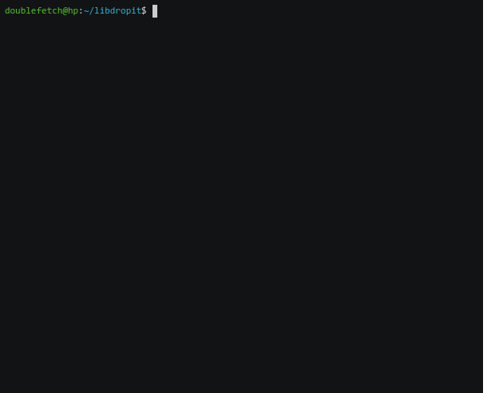

# DropIt

This is a proof-of-concept implementation of the DropIt library.

# Usage
To use DropIt, simply include `libdropit.h`.
To protect a section containing a double fetch, only 3 lines of code have to be added.

* First, initialize the library for the section: `doublefetch_t config = doublefetch_init(<retries>);`
* Second, before the section starts, add `doublefetch_start(config);`
* Finally, after the section, add `doublefetch_end(config, <fallback code>);`

That's it, now your code is protected.

# Example

```c
char buffer[8];
size_t len;
// init DropIt
doublefetch_t config = doublefetch_init(10);
// start DropIt
doublefetch_start(config);
// first access to string
len = strlen(string);
if(len < 8) {
    // second access to string
    strcpy(buffer, string);
}
// end of critical section
doublefetch_end(config, { printf("Too many tries to exploit the double-fetch, could not perform safe copy!\n"); exit(-1);});
```

# Demo

The repository contains 2 demos. To build them, simply run `make`.

## demo-strlen


This demo shows how to protect a naive string copy function containing a double-fetch bug using DropIt.
Run `./strlen-demo-without-dropit` to see how the double-fetch bug can be exploited to crash the application.
Run `./strlen-demo` to see that the same program with the same exploit is now protected and does not crash anymore.

## switch-demo



This demo shows a compiler-introduced double-fetch bug which is not visible in the source code.
Run `./switch-demo-without-dropit` to see how the double-fetch bug can be exploited to crash the application.
Run `./switch-demo` to see that the same program with the same exploit is now protected and does not crash anymore.

